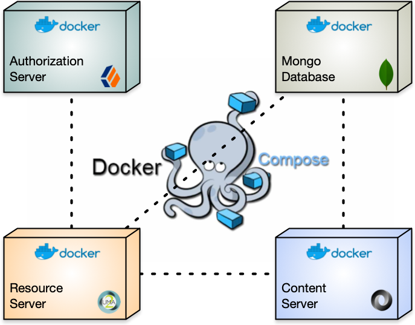

# frdp-containers-uma

ForgeRock Demonstration Platform (FRDP) : **Containers UMA** : Is a project that provides a *Ready-2-Run* environment for testing the User-Managed Access (UMA) Reference Implementation.  The project requires [`docker` and `docker-compose`](http://docs.docker.com) technologies.  The [Docker Desktop for Mac](https://docs.docker.com/docker-for-mac/install/) was used to develop this project.



`git clone https://github.com/ForgeRock/frdp-containers-uma.git`


# Disclaimer

THE SOFTWARE IS PROVIDED "AS IS", WITHOUT WARRANTY OF ANY KIND, EXPRESS OR IMPLIED, INCLUDING BUT NOT LIMITED TO THE WARRANTIES OF MERCHANTABILITY, FITNESS FOR A PARTICULAR PURPOSE AND NONINFRINGEMENT. IN NO EVENT SHALL THE AUTHORS OR COPYRIGHT HOLDERS BE LIABLE FOR ANY CLAIM, DAMAGES OR OTHER LIABILITY, WHETHER IN AN ACTION OF CONTRACT, TORT OR OTHERWISE, ARISING FROM, OUT OF OR IN CONNECTION WITH THE SOFTWARE OR THE USE OR OTHER DEALINGS IN THE SOFTWARE.

# License

[MIT](/LICENSE)

# Requirements

## Docker

Install [**docker**](https://docs.docker.com/get-started/) on your desktop

## ForgeRock Access Manager / Amster

This project uses the ForgeRock Access Manager 6.5.2 which provides User-Manager Access (UMA) Authorization Server functionality. The ForgeRock Amster utility is used to automate the configuration of Access Manager.  Access Manager and Amster can be download from the ForgeRock [backstage](https://backstage.forgerock.com/downloads/browse/am/latest) web site.  

**NOTICE:** You need an account to access the ForgeRock backstage resources.

1. Download the **Access Manager** zip file and save it to a temporary location.
1. From the temporary Access Manager location, expanded zip file 
1. From the temporary Access Manager location ...\
Copy the `openam/AM-6.5.2.x.war` file to: \
`containers/auth-server/docker/build/resources/am.war`
1. Download the **Amster** zip file and save it to a temporary location.
1. Copy the `Amster-6.5.2.x.zip` file to: \
`containers/auth-server/docker/build/resources/amster.zip`

# Setup

## hostnames

You must add the following aliases to the `/etc/hosts` file for `localhost`
- `as.example.com`
- `rs.example.com`

### For MacOS

```bash
sudo vi /etc/hosts
```
 - **BEFORE**: \
`127.0.0.1       localhost`
- **AFTER**: \
`127.0.0.1       localhost as.example.com rs.example.com`

# Run

Use the `docker-compose` command build and run the Docker containers:

```bash
$ cd frdp-containers-uma
$ docker-compose up --build
```

# Verify

## Docker

After the *build* process is complete, check that the containers are running.  Open another terminal and run `docker ps`:

```bash
CONTAINER ID        IMAGE               COMMAND                  CREATED             STATUS              PORTS                      NAMES
55b21cf3050c        uma-rs              "catalina.sh run"        29 seconds ago      Up 28 seconds       0.0.0.0:8090->8080/tcp     uma-rs
3024a33fab15        uma-cs              "catalina.sh run"        30 seconds ago      Up 29 seconds       0.0.0.0:8085->8080/tcp     uma-cs
240022b09471        uma-as              "catalina.sh run"        30 seconds ago      Up 29 seconds       0.0.0.0:8080->8080/tcp     uma-as
be18f3fcf73f        uma-db              "docker-entrypoint.s…"   30 seconds ago      Up 29 seconds       0.0.0.0:27017->27017/tcp   uma-db
```
## Authorization Server

Log into the Authorization Server as the two test users. Open a web browser and access ... `http://as.example.com/8080/am`

| User | Password | First name | Last name | UMA operations |
| ---- | -------- | ---------- | --------- | -------------- |
| `dcrane` | `password` | Danny | Crane | Resource Owner |
| `bjensen` | `password` | Barb | Jensen | Requesting Party |

- From the top toolbar
- Select **SHARES** drop down menu
- Select **RESOURCES** menu item
- From Left Menu ...\
**My Resource** displays the user's registered UMA resources \
**Shared with Me** displays resource's the user can access

**Note:** You will not see any UMA resources until they are registered and have a policy.

# Testing

To test the UMA containers environment, [**postman**](https://www.postman.com/downloads/) collections have been provided. 

See the [Postman testing procedures](/postman/README.md) 

# Reference

## Properties

| Name | Value |
| ---- | ----- |
| Domain Name | `example.com` |
| Default Password | `password` |

## Images / Containers

| Description | Hostname | Image Name | Container Name | Host Port | Container Port |
| ----------- | -------- | ----- | --------- | -------- | ---- |
| Authorization Server | `as`    | `uma-as`    | `uma-as`    | `8080` | `8080`
| Mongo Database       | `db`    | `uma-db`    | `uma-db`    | `27017` | `27017`
| Content Server       | `cs`    | `uma-cs`    | `uma-cs`    | `8085` | `8080`
| Resource Server      | `rs`    | `uma-rs`    | `uma-rs`    | `8090` | `8080`

## Services

The *containers* expose services that are mapped to `localhost`, on specific ports.  

| Server | URL | Description |
| ------ | --- | ----------- |
| Authorization Server | http://localhost:8080/am | ForgeRock Access Manager
| Content Server | http://localhost:8085/content-server | CRUD REST service for JSON content
| Resource Server | http://localhost:8090/resource-server | Reference Implementation of UMA Resource Server 
## Related projects

The following GitHub repositories are used:

- [frdp-framework](https://github.com/ForgeRock/frdp-framework)
- [frdp-dao-mongo](https://github.com/ForgeRock/frdp-dao-mongo)
- [frdp-content-server](https://github.com/ForgeRock/frdp-content-server)
- [frdp-dao-rest](https://github.com/ForgeRock/frdp-dao-rest)
- [frdp-uma-resource-server](https://github.com/ForgeRock/frdp-uma-resource-server)
